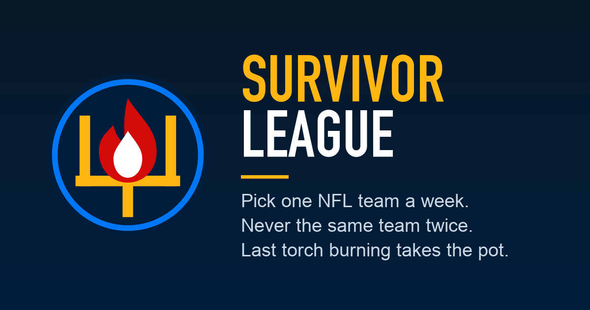

# Survivor League

An NFL survivor pool app for your family or friends. Everyone picks one team a week to win. Pick a loser and your torch goes out. You can never use the same team twice. The last one standing takes the pot.



## What it does

- Picks lock per game at kickoff and stay hidden from the rest of the league until then.
- Live scores, standings, and point spreads from ESPN, refreshed on game days.
- Buy-backs: lose early, pay to get back in before a deadline, and the commissioner confirms the money.
- The pot, who has paid, and a full activity log of every pick and change.
- Households: one login can make picks for a spouse or the kids.
- Trash Talk chat, with an optional AI host who roasts bad picks.
- Weekly email reminders, if you want them.
- A Hall of Fame for past champions.
- Works as a home-screen app on iPhone and Android.

## Set up your own league

It takes about 15 minutes. You need a free GitHub account and a free Netlify account.

1. Click **Use this template** at the top of this page, then **Create a new repository**. Call it whatever you like. Private is fine.
2. In Netlify, choose **Add new site**, then **Import an existing project**. Connect GitHub and pick your new repo. Netlify reads the build settings from `netlify.toml`, so click **Deploy**. The first build runs the test suite, then publishes the site.
3. Open the new site. It asks you to **create your league**: the name, season, buy-in, buy-back price, sudden-death week, how many slots a player can hold, and an admin PIN. Do this right away. Whoever opens a brand-new site first becomes its commissioner.
4. You land on the commissioner desk. Read the rules under **League settings**. The league starts with a standard rulebook written from your numbers, and you can edit every word.
5. Share the link. Players tap **Join** and choose a name and a PIN. Sign-ups stay open until the last game of week 1 kicks off.

Want a nicer address than `something.netlify.app`? Add your own domain under **Domain management** in Netlify.

## Settings that live in Netlify

Set these under **Site configuration**, then **Environment variables**, and deploy again so they take effect. Every one is optional.

| Variable | What it does |
|---|---|
| `LEAGUE_NAME` | Your league's name in link previews (iMessage, Slack, Facebook). Match what you called the league. |
| `LEAGUE_TIMEZONE` | The league's clock for kickoff times, deadlines, and reminders. Any IANA zone name, like `America/Chicago`. Defaults to `America/New_York`. |
| `RESEND_API_KEY` and `REMINDER_FROM` | Turn on email reminders through [Resend](https://resend.com). `REMINDER_FROM` looks like `Smith League <picks@yourdomain.com>` and needs a domain you have verified in Resend. |
| `REMINDER_REPLY_TO`, `REMINDER_SUMMARY_TO` | Where replies go, and who gets a summary after each reminder run. |
| `ANTHROPIC_API_KEY` | Turns on the Trash Talk host. It costs a little per message, and the host has daily limits built in. |

With email on, reminders go out at noon league time: Thursday to everyone, Monday only to players still missing a pick. You can also send them by hand from the desk.

## Running the league

- The commissioner desk lives under **More**, then **Commissioner**, behind your admin PIN. That is where you confirm buy-ins and buy-backs, fix a pick, send reminders, edit the rules, set up the chat host, and add Hall of Fame winners.
- Money moves outside the app, by Venmo or cash. The app tracks who owes what, and the commissioner confirms each payment by hand.
- One season per league for now. The app does not roll over to a new season yet.

## Make it yours

- Colors and fonts: `public/styles.css`.
- The icon: `public/icon-512.png`, `public/apple-touch-icon.png`, and the inline SVG in `public/index.html`. The link preview image is `public/og.png`.
- The rules the app enforces: `lib/rules.mjs`. The words players read: `lib/rules-text.mjs` for new leagues, and your league's own copy under League settings. Keep them in step.
- The chat host's personalities: `lib/host.mjs`. The commissioner can also write one from the desk.

## How it works

- `public/` is the app: plain JavaScript, no build step.
- `netlify/functions/api.mjs` is the whole backend, in one function.
- `netlify/functions/reminder-cron.mjs` and `host-cron.mjs` are the scheduled jobs for reminders and the chat host.
- `lib/` holds the rules engine, the ESPN feed, email, and small helpers.
- Data lives in Netlify Blobs, inside your Netlify site. There is no database to set up.
- Schedules, scores, and spreads come from ESPN's public scoreboard. Win odds come from survivorgrid.com. Neither is an official API, so either can change without notice. The app keeps working without win odds.

## Changing the code

```bash
npm install
npm test
```

Push to your repo's `main` branch and Netlify rebuilds. A failing test fails the build, and the live site stays on the last good version. To click through your changes against your live league's data, run `LIVE=https://your-league.netlify.app node scripts/dev-preview.mjs` and open http://localhost:8922. It is read-only: it loads pages from your live site and refuses any change.

## Not affiliated

Not affiliated with or endorsed by the NFL, ESPN, or SurvivorGrid. Team names and logos belong to their owners.

## License

MIT. See `LICENSE`.
